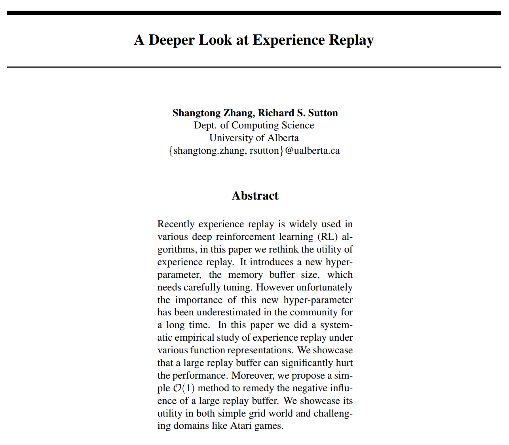

**Title**: A Deeper Look at Experience Replay

**Authors**

<ul class="slowpapers__authors">
  <li><a href="https://shangtongzhang.github.io/">Shangtong Zhang</a>, Graduate student at University of Oxford</li>
  <li><a href="http://www.incompleteideas.net/">Richard S. Sutton</a>, Professor at University of Alberta</li>
</ul>

**Prerequisites**
 - *Playing Atari with Deep Reinforcement Learning* (Mnih et al., 2013) [[PDF]](https://arxiv.org/abs/1312.5602)
 - *Human-level control through Deep Reinforcement Learning* (Mnih et al., 2015) [[PDF]](https://storage.googleapis.com/deepmind-media/dqn/DQNNaturePaper.pdf)

**Accompanying Resources**

 - *Self-improving reactive agents based on reinforcement learning, planning and teaching* (Lin, 1992) [[PDF]](http://www.incompleteideas.net/lin-92.pdf)
 - *Prioritized Experience Replay* (Schaul et al., 2015) [[PDF]](https://arxiv.org/abs/1511.05952)
 - *Hindsight Experience Replay* (Andrychowicz et al., 2017) [[PDF]](https://arxiv.org/abs/1707.01495)
 - *The Effects of Memory Replay in Reinforcement Learning* (Liu and Zou, 2017) [[PDF]](https://arxiv.org/abs/1710.06574)
 - *Time Limits in Reinforcement Learning* (Pardo et al., 2017)[[PDF]](https://arxiv.org/abs/1712.00378)

*This is a part of the [**Slow Papers**](/slowpapers) series that peruses each selected paper slowly to gain a deeper understanding of the paper.*

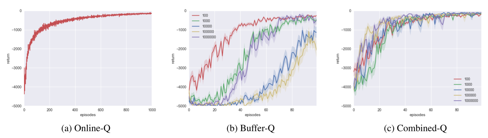

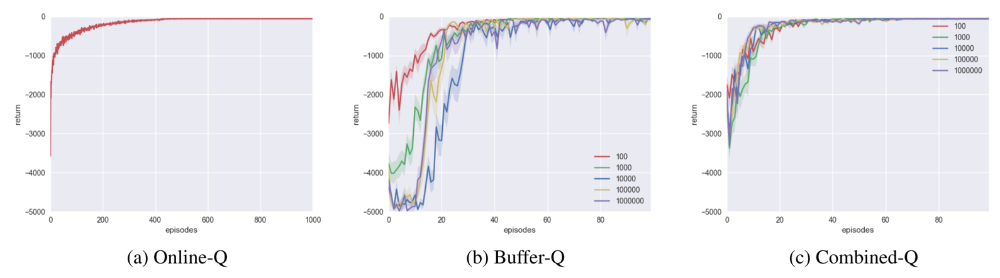

However, it had little to no impact in these environments:
 * Lunar Lander with non-linear function approximator
 * Pong with non-linear function approximator

As the varied degree of success show, "CER is only a workaround, the idea of experience replay itself is heavily flawed."

## 1 Introduction

<figure>
  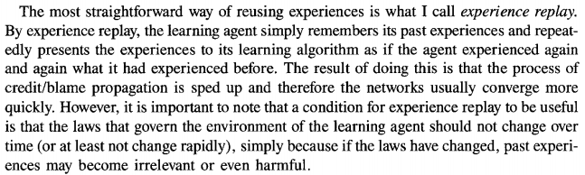
  <figcaption>From <em>Self-improving reactive agents based on reinforcement learning, planning and teaching</em> (Lin, 1992)</figcaption>
</figure>

Experience replay is a technique that has been incorporated to many seminal deep reinforcement learning algorithms. These include [Deep Deterministic Policy Gradient (DDPG)](https://arxiv.org/abs/1509.02971), [Hindsight Experience Replay (HER)](https://arxiv.org/abs/1707.01495) and all [Deep Q-Networks (DQN)](https://arxiv.org/abs/1312.5602) methods. The popularity can be attributed to the fact that it is the only method that can generate uncorrelated data for online training. (One exception is using parallel workers, but this is more a circumvention than a direct solution.)

<figure>
  
  <figcaption>From <em>Playing Atari with Deep Reinforcement Learning</em> (Mnih et al., 2013)</figcaption>
</figure>

<figure>
  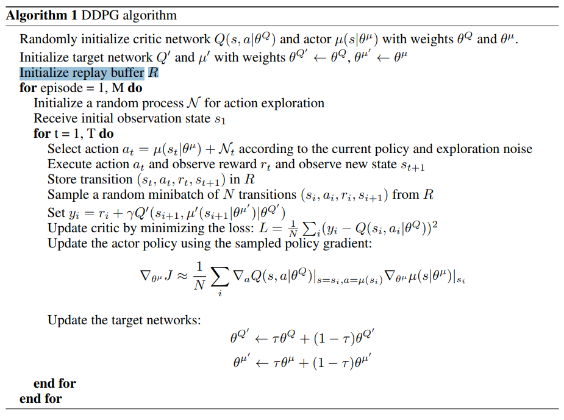
  <figcaption>From <em>Continuous Control with Deep Reinforcement Learning</em> (Lillicrap et al., 2015)</figcaption>
</figure>

<figure>
  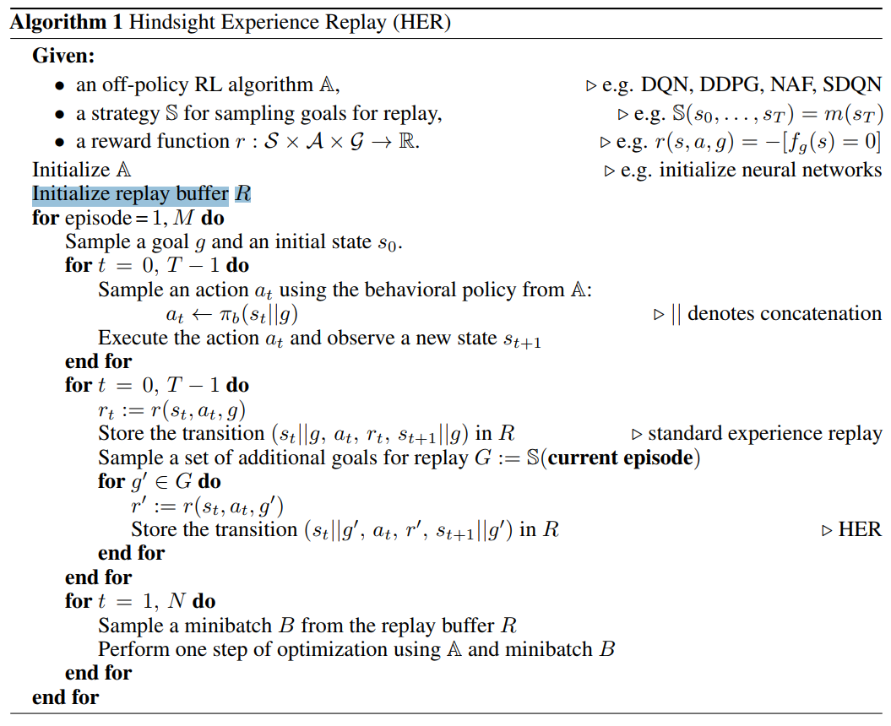
  <figcaption>From <em>Hindsight Experience Replay</em> (Andrychowicz et al., 2017)</figcaption>
</figure>

Although experience replay has been integrated to widely different algorithms with different neural network architectures that interact with different environments, its effects are relatively unknown beyond the obvious increased data efficiency. This is because experience replay has been used mostly in deep reinforcement learning algorithms, which tend to be very noisy, disallowing making meaningful conclusions. We show that experience replay also has 

Furthermore, in most experiments, the replay buffer was set to a default capacity of $10^6$. This is not a problem if experience replay is robust under such differences. However, as we show in this paper, the size of the replay buffer can heavily hurt the speed of learning and quality of the resulting agent. If the replay buffer is too small, the replay buffer serves little to no purpose. If the replay buffer is too big, the batched samples are uncorrelated, but the agent will learn from the newest experience a long time after.

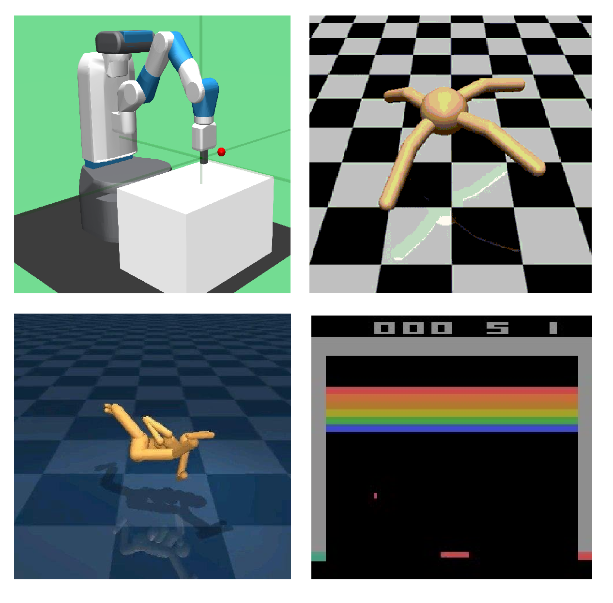

Thus, to mitigate this problem, we combine online learning and experience replay into **Combined Experience Replay**. At each timestep, the agent learns from a batch that consists of both the immediate transition $t$ and the sampled minibatch $B$.

<figure>
  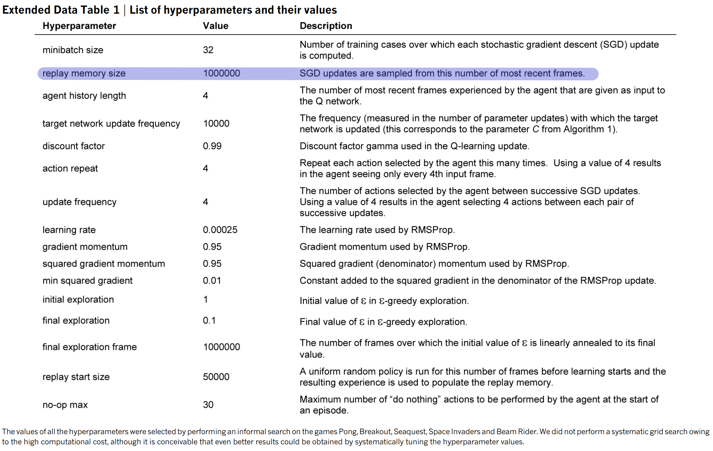
  <figcaption>From <em></em> (Mnih et al., 2015)</figcaption>
</figure>
<figure>
  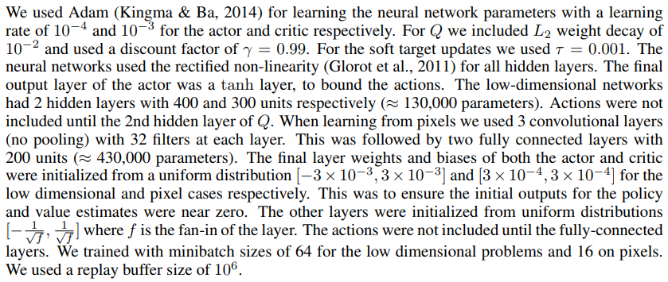
  <figcaption>From <em></em> (ASDF et al., 2016)</figcaption>
</figure>
<figure>
  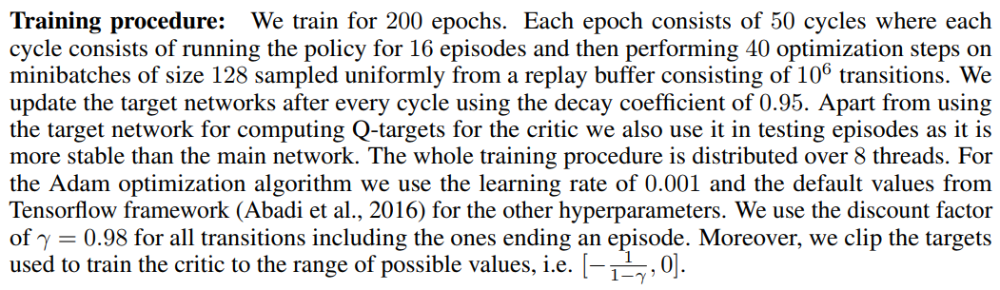
  <figcaption>From <em></em> (ASDF et al., 2017)</figcaption>
</figure>
In summary, we make two contributions in this paper:

1. A **systematic evaluation** of the effects of the size of replay buffer on performance with various function representations
2. The **combined experience replay** (CER) method that makes the algorithm more robust to experience replay size

<figure>
  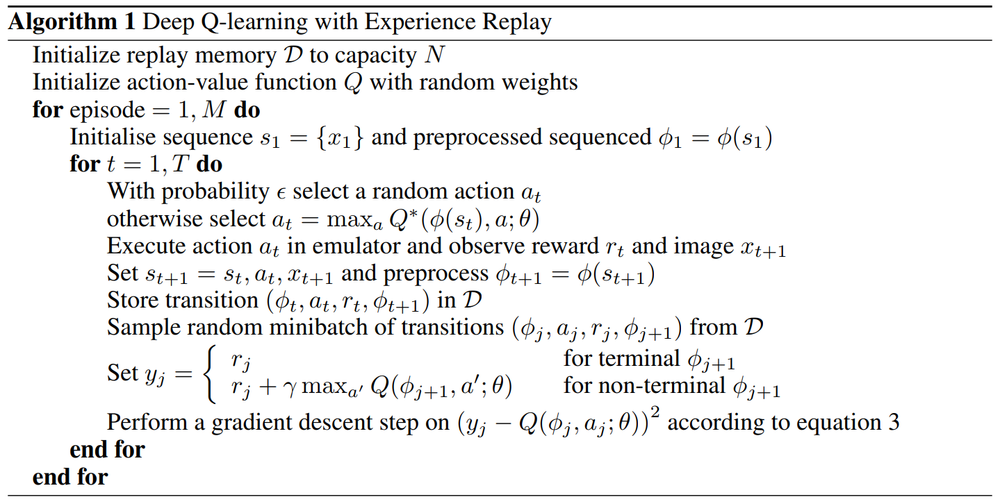
  <figcaption>From <em>Playing Atari with Deep Reinforcement Learning</em> (Mnih et al., 2013)</figcaption>
</figure>
## 2 Related Work

There exists another improvement of experience replay called prioritized experience replay (Schaul et al., 2015). In the original experience replay, transitions are sampled randomly with equal probability to form a batch. As the name suggests, in PER, transitions are sampled with unequal probabilities, with "valuable" transitions given higher probability.

Although it is possible to think of CER as a specific case of PER, they differ both in their use. PER was designed to further increase data efficiency, whereas CER was designed to remedy the negative effects of a large replay buffer. In other words, with a properly set replay buffer size, incorporating CER would not have a big impact on performance, but PER will.

We omit the discussion of complexity as we have not introduced CER yet.

[TODO Liu and Zou 2017]

[TODO ER vs Dyna]

## 3 Algorithms

We expect the reader to be familiar with experience replay. Experience replay is the idea of storing previous transitions and sampling minibatches to train the agent. Experience replay by itself is not a reinforcement learning algorithm: it must be combined with another algorithm to be complete. In this paper, we combine it with Q-learning, following the DQN paradigm. Again, we expect the reader to be familiar with Q-learning.

<figure>
  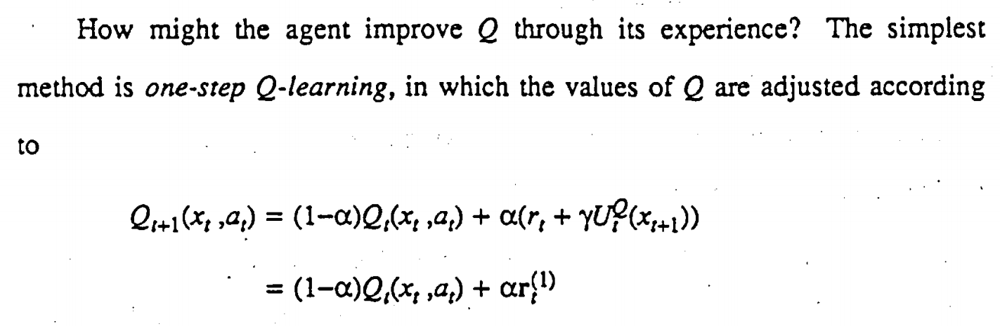
  <figcaption>From page 96 of <em>Learning from Delayed Rewards</em> (Watkins, 1989)</figcaption>
</figure>

We define three different Q-learning algorithms: Online-Q, Buffer-Q, and Combined-Q.

**Online-Q** is the online Q-learning algorithm, where no experience replay is used. The agent learns from each transition once and discards it immediately after.

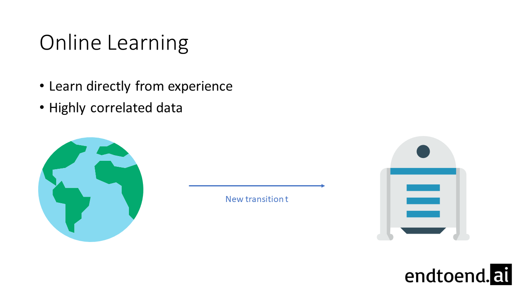

**Buffer-Q** is Q-learning with experience replay. Every transition is stored into the replay buffer $D$. The agent learns by sampling a batch $B$ from this buffer. This is equivalent to the Q-learning used in DQNs.

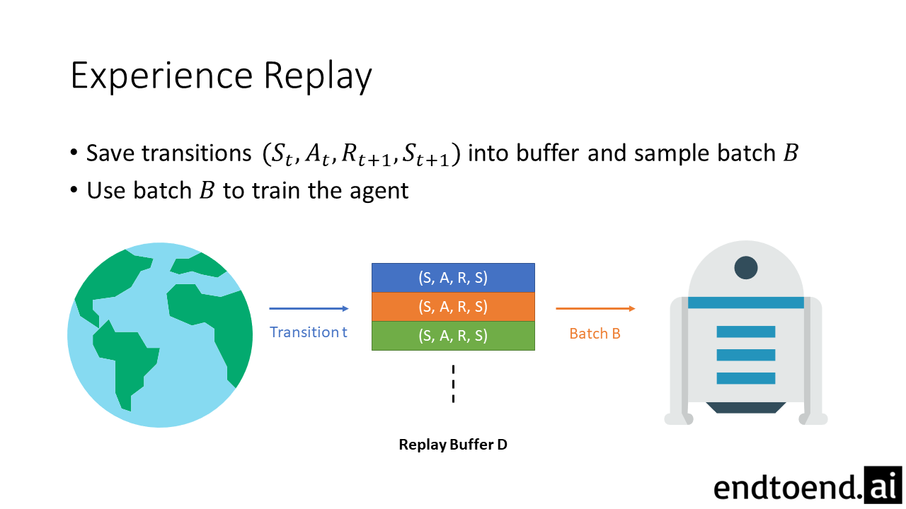

**Combined-Q** is the combination of online learning and learning with experience replay. All transitions are stored into the replay buffer $D$ and sampled for learning. However, the agent learns not only from the sampled batch $B$ but also from the just-experienced transition $t$.

## 4 Testbeds

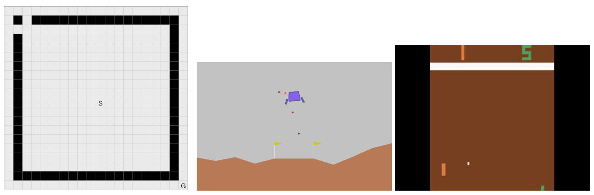

We test these algorithms on three popular environments: Gridworld, Lunar Lander, and Atari Pong (RAM).

In **Gridworld**, the agent starts at a start state $S$ and seeks to reach the fixed goal state $G$. The agent has 4 actions (1 for each direction), and gets a reward of -1 at each timestep. The black squares define walls, which signify area that the agent cannot move to. If the agent attempts to move to the wall, it will remain in the same position.

[**LunarLander**](https://gym.openai.com/envs/LunarLander-v2/) and [**Pong (RAM)**](https://gym.openai.com/envs/Pong-ram-v0/) are well-known environments for testing reinforcement learning algorithms. We direct unfamiliar readers to the official documentation.

To conduct experiments efficienctly, we incorporate **timeout** in all three tasks. In other words, each task has a maximum episode length, and the episode will end automatically after reaching this length. This is necessary in practice since otherwise an episode can be arbitrarily long. Since this is still a modification of the task, we use a large enough timeout (5000, 1000, 10000 steps respectively) to reduce the influence in our results. To further reduce the effects of timeout, we use **partial-episode-bootstrap** (PEB) by Pardo et al. (2017).

<figure>
  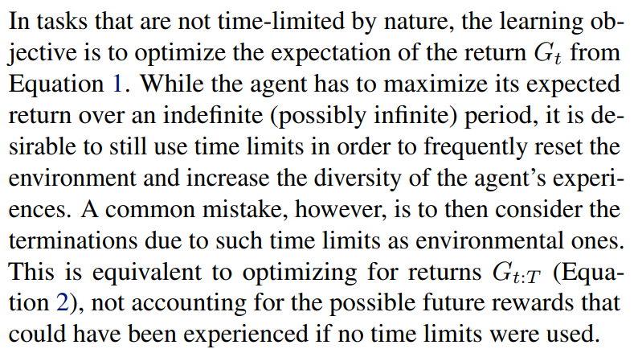
  <figcaption>From <em>Time Limits in Reinforcement Learning</em> (Pardo et al., 2017)</figcaption>
</figure>

| Hyperparameters        | Value |
| ---------------------- | ----- |
| Minibatch Size         | 10    |
| Exploration $\epsilon$ | 0.1   |

## 5 Evaluation
Combined-Q significantly improved the performance for suboptimal replay buffer sizes in these environments:

- Gridworld with tabular function representation
- Gridworld with linear function approximator
- Gridworld with non-linear function approximator

## 5.1 Tabular Function Representation

## 5.2 Linear Function Approximation
## 5.3 Non-linear Function Approximation
## 6 Conclusion

[TODO Flaw of ER]

[TODO CER is only a workaround]

## Final Thoughts

**Questions**
 - The authors claim that CER and PER are different in Section 2. Then, are they modular enough to be implemented together? Will implementing both PER and CER improve or hurt performance?
 - The authors claim that timeouts make the environment non-stationary. Why?

**Recommended Next Papers**

 - [The Effects of Memory Replay in Reinforcement Learning (Liu and Zou, 2017)](https://arxiv.org/abs/1710.06574)
