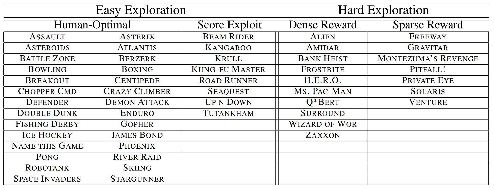
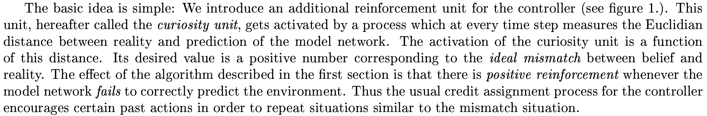
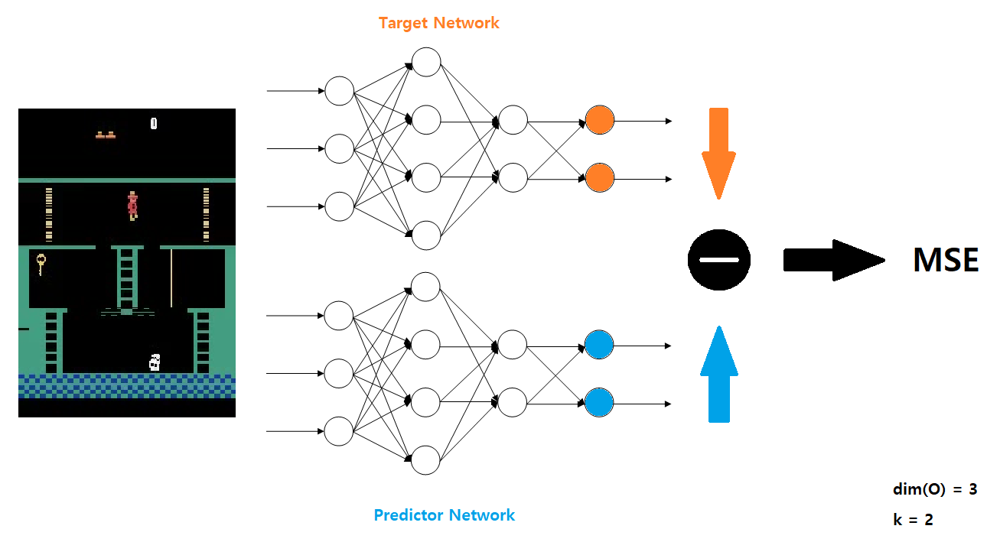
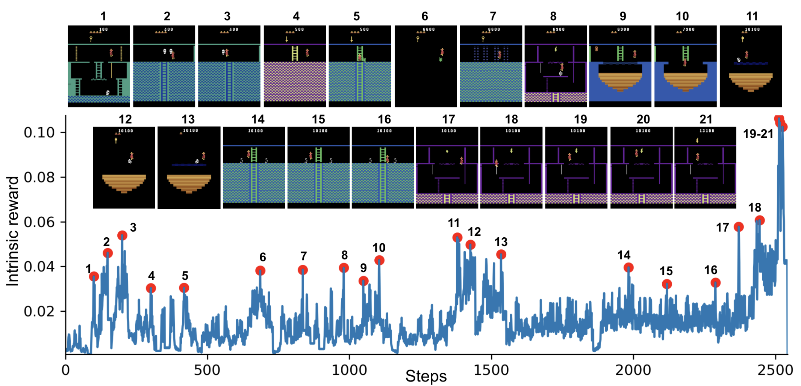
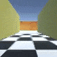
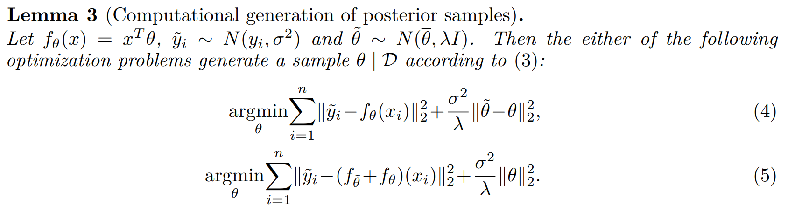
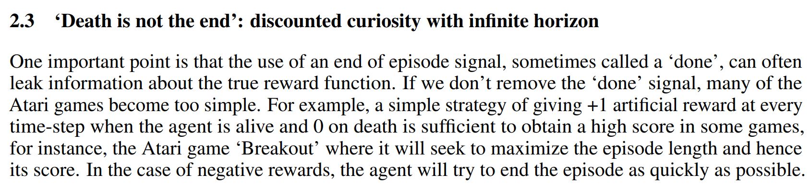

**Title**: Exploration by Random Network Distillation

**Authors**

<ul class="slowpapers__authors">
  <li>Yuri Burda</li>
  <li>Harrison Edwards</li>
  <li>Amos Storkey</li>
  <li>Oleg Klimov</li>
</ul>

**Prerequisites**

 - *Curiosity-driven Exploration by Self-supervised Prediction* (Pathak et al., 2017) [[Arxiv]](https://arxiv.org/abs/1705.05363)
 - *Randomized Prior Functions for Deep Reinforcement Learning* (Osband et al., 2018) [[Arxiv]](https://arxiv.org/abs/1806.03335)

**Accompanying Resources**

* Implementation of RND in the ICLR2019 submission [[Code]](https://goo.gl/DGPC8E)
* *Large-Scale Study of Curiosity-Driven Learning* (Burda et al., 2018) [[Arxiv]](https://arxiv.org/abs/1808.04355)
* *Proximal Policy Optimization Algorithms* (Schulman et al., 2017) [[Arxiv]](https://arxiv.org/abs/1707.06347)

This is a part of the [**Slow Papers**](/slowpapers) series that peruses each selected paper slowly to gain a deeper understanding of the paper.

This review was first presented the reading group of Reinforcement Learning Korea (RL Korea). Thank you to the members for helpful feedback.

## 1 Introduction

Reinforcement Learning works well when the reward function is dense and easy to find.

* **Dense**: A lot of rewards are nonzero.
* **Easy to find**: A random agent finds nonzero rewards.

However, reinforcement learning algorithms fail when the rewards are sparse and hard to find. One solution would be to hand-engineer dense reward functions. However, this is often impractical or impossible. Another solution is to develop more sophisticated exploration methods. Exploration methods have been a popular research topic, with a lot of new sophisticated methods with better results on hard exploration games. (Check my [**rl-exploration**](https://github.com/seungjaeryanlee/rl-exploration) repository for an overview of exploration methods)

| Count-based                                               | Curiosity                                                  |
| --------------------------------------------------------- | ---------------------------------------------------------- |
| Unifying Count-Based Exploration and Intrinsic Motivation | Curiosity-driven Exploration by Self-supervised Prediction |
| Count-Based Exploration with Neural Density Models        | Large-Scale Study of Curiosity-Driven Learning             |

However, these exploration methods are difficult to scale up: due to their complexity, it is difficult to deploy them in parallel environments. This is a crucial problem, since recent state of the art methods rely on using parallel environments to collect large number of samples. In contrast, we propose an approach called **Random Network Distillation** (hereafter RND) that is simpler to implement, works with high-dimensional observations, can be incorporated with policy optimization algorithms, and efficient. 

We experiment with RND on selected *Atari 2600* games, a standard benchmark for deep reinforcement learning algorithms. We select hard exploration games with sparse rewards: Freeway, Gravitar, Montezuma's Revenge, Pitfall!, Private Eye, Solaris, and Venture.

<figure>
  
  <figcaption>From <em>Count-Based Exploration with Neural Density Models</em> (Ostrovski et al., 2017)</figcaption>
</figure>

Combined with PPO, **RND achieves state-of-the-art performance in Montezuma's Revenge**, periodically finds all 24 rooms and solves the first level without using demonstrations or having access to the underlying state of the game.

<iframe width="560" height="315" src="https://www.youtube.com/embed/40VZeFppDEM" frameborder="0" allow="accelerometer; autoplay; encrypted-media; gyroscope; picture-in-picture" allowfullscreen></iframe>

## 2 Methods

### 2.1 Exploration Bonuses

**Exploration bonuses** are a class of methods that encourages exploration even when the reward $e_t$ is sparse. This is done by augmenting $e_t$ to create a new reward $r_t = e_t + i_t$, where $i_t$ is the **exploration bonus** associated with the transition at time $t$. The reward given by the environment is often called the **extrinsic reward**, and the augmented reward is called the **intrinsic reward**.

To encourage exploration, the intrinsic reward $i_t$ should be designed so that it is high in novel states than in frequently visited states. In a tabular setting with a finite number of states, this is easy: we can simply count the number of visits at each state. Then, we can define $i_t$ as a decreasing function of the visitation count $n(s)$. These are called **count-based exploration methods**.

$$
i_t = \frac{\beta}{n(s)}, \frac{\beta}{\sqrt{n(s)}}
$$
In non-tabular cases, it is difficult to define counts, as most states are visited at most once. A possible generalization is to use define a **pseudo-count**, using state density estimates $N(s)$ as an exploration bonus. Using density estimates, even states that have never been visited have positive pseudo-count if it is similar to other visited states.

Another way to design the intrinsic reward $i_t$ is to define it with a **prediction error** for a problem related to the agent's transitions. 

<figure>
  
    <figcaption>From <em>A Possibility for Implementing Curiosity and Boredom in Model-Building Neural Networks</em> (Schmidhuber, 1991)</figcaption>
</figure>
The most relevant example would be the **Intrinsic Curiosity Module** (Pathak et al., 2017; Burda et al., 2018). The Intrinsic Curiosity Module (hereafter ICM) trains forward model that outputs a prediction $\hat{\phi}(s_{t+1})$ that attempts to predict the encoded next state $\phi(s_{t+1})$ given encoded state $\phi(s_t)$ and action $a_t$. The intrinsic reward $r^i_t$ is defined as the prediction error of the forward model. The forward model is trained as the agent explores the environment. Thus, low prediction error means that the ICM has understood the transition $(s_t, a_t)$.

<figure>
  
  <figcaption>From <em>Curiosity-driven Exploration by Self-supervised Prediction</em> (Pathak et al., 2017)</figcaption>
</figure>

### 2.2 Random Network Distillation

We introduce **Random Network Distillation (RND)**, a state-based prediction-error-based exploration method. We define two networks: a **target network** $f$ and a **predictor network** $\hat{f}$. The target network is fixed after random initialization, and is the target of the prediction problem.The predictor network trains on the data collected by the agent to solve the prediction problem. In other words, with the data collected by the agent, the predictor network $\hat{f}$ is trained via gradient descent to minimize the MSE error:
$$
|| \hat{f}(x;\theta) - f(x) ||^2
$$
This training process **distills** a randomly initialized (target) network into a trained (predictor) network.

Similar to the ICM, the prediction error is low on states that are similar to states already visited. In contrast, the prediction error is higher for novel states that are different from the states the predictor network has been trained on. Thus, we define the intrinsic reward $i_t$ as the MSE error of the two networks $f$ and $\hat{f}$.

<figure>
  
  <figcaption>The architecture of RND</figcaption>
</figure>

To test the validity of detecting novelty through the prediction error of target and predictor networks, we consider a toy model with MNIST. We train the predictor neural network on a mixed dataset of images with two classes: the 0 class and the target class (ex. 1). The 0 class represent states have been seen many times before, and the target class represent novel states. We vary the proportion of 0 class to target class while keeping the total amount of data constant, and see that the test error decreases when more target class data is available.

We also see empirically see that in Montezuma's Revenge, the spikes in the intrinsic reward (or the prediction error) correspond to meaningful events: losing a life (2, 8, 10, 21), escaping an enemy by a narrow margin (3, 5, 6, 11, 12, 13, 14, 15), passing a difficult obstacle (7, 9, 18), or picking up an object (20, 21).

### 2.2.1 Sources of Prediction Errors

Generally, in deep learning, prediction error can be attributed to four factors:

1. **Amount of training data**: Prediction error is high because the predictor fails to generalize from previous seen examples.
2. **Stochasticity**: Prediction error is high because the prediction target is stochastic.
3. **Model misspecification**: Prediction error is high because information necessary for prediction is missing, or because the predictor's model is too limited to model the complexity of the prediction target.
4. **Learning dynamics**: Prediction error is high due to failing to find the best approximation of the prediction target in the optimization process.

Factor 1 is a useful source of error, since it validates the use of RND. However, other sources of prediction errors can create undesirable effects in prediction-based exploration methods. 

The most famous example is the noisy-TV problem, relevant to factor 2. Consider a maze environment with visual input. In this deterministic environment, maximizing prediction error would be beneficial, since it rewards exploring unvisited areas. Now, suppose there is a noisy TV attached to a wall inside the maze. Now, if the agent ever looks at the TV, it will always receive high reward, due to its randomness.

Although this example might feel too artificial, prediction-based exploration was shown to be attracted to the inherent stochasticity of the environment. This includes Montezuma's Revenge.

Previous methods tried to avoid these factors by using the relative improvement of the prediction error $\Delta E$, rather than the absolute error $E$. Sadly, this is difficult to implement efficiently. In contrast, RND obviates both factors 2 and 3. The target network is fixed, so it is deterministic, not stochastic. Also, the target network and the predictor network has the same architecture, so the model cannot be limited.

### 2.2.2 Relation to Uncertainty Quantification

It is possible to see the prediction error of RND as a **quantification of uncertainty**.

Consider a regression problem with the data distribution $D = \{x_i, y_i\}_i$. In the Bayesian setting, we would consider a prior $p(\theta^*)$ over the parameters of a mapping $f_{\theta^*}$, then calculate the posterior after updating on the evidence.

We follow Lemma 3 of Osband et al. (2018).

<figure>
  
  <figcaption>From <em>Randomized Prior Functions for Deep Reinforcement Learning</em> (Osband et al., 2018)</figcaption>
</figure>

Let $\mathcal{F}$ be the distribution over functions $g_\theta = f_\theta + f_{\theta^*}$ (ensemble). $\theta^*$ is drawn from the prior $p(\theta^*)$, and $\theta$ is given by minimizing the expected prediction error
$$
\theta = \text{argmin}_\theta \mathbb{E}_{(x_i, y_i) ~ D} || f_\theta(x_i) + f_{\theta^*}(x_i)-y_i||^2 + \mathcal{R}(\theta)
$$
where $\mathcal{R}(\theta)$ is a regularization term shown at the end of equations (4) and (5) of Lemma 3.

Now, let us confine the regression problem to predicting the constant zero function $y_i = 0$.
$$
\theta = \text{argmin}_\theta \mathbb{E}_{(x_i, y_i) ~ D} || f_\theta(x_i) + f_{\theta^*}(x_i)||^2 + \mathcal{R}(\theta)
$$
Then, the optimization problem is equivalent to distilling a randomly drawn function from the prior. With $f_\theta^*$ being the target and $f_\theta$ being the predictor, the distillation error can be seen as a quantification of uncertainty in predicting the constant zero function $y_i = 0$.

### 2.3 Combining Intrinsic and Extrinsic Returns

When using only intrinsic reward, not truncating the return when the game is over resulted in better exploration. This signifies that the agent's intrinsic return should be related to all the novel states that it could find in the future

<figure>
  
  <figcaption>From <em>Large-Scale Study of Curiosity-Driven Learning</em> (Burda et al., 2018)</figcaption>
</figure>

## 3 Experiments

### 3.1 Pure Exploration

### 3.2 Combining Episodic and Non-episodic Returns

### 3.3 Discount Factors

### 3.4 Recurrence

### 3.5 Scaling Up RNN Training

### 3.6 Comparison to Baselines

### 3.7 Qualitative Analysis: Dancing with Skulls

## 4 Related Work

## 5 Discussion

## Final Thoughts

**Questions**
 - In Section 2.3, the authors argue that treating the problem as non-episodic makes sense since the agent's intrinsic return should be related to all the novel states it could find in the future. 

**Recommended Next Papers**
 - *Because this paper is so new, there isn't a "next paper." Instead, I urge you to check the **Accompanying Resources** section and read them to learn more about intrinsic rewards.*
