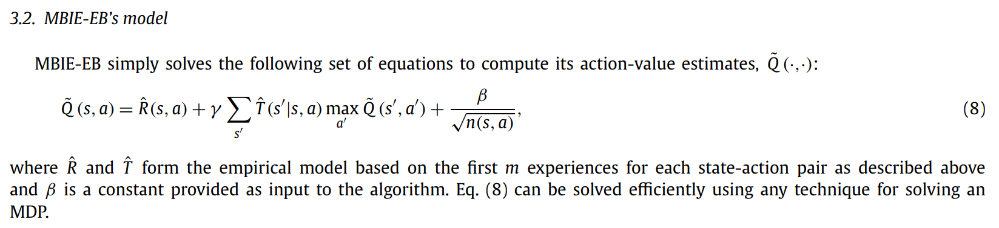
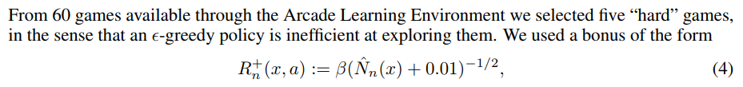

**Title**: Exploration by Random Network Distillation

**Authors**
Anonymous (Under double-blind review at ICLR 2019)

**Prerequisites**
 - TBA

**Accompanying Resources**

* *Unifying Count-based Exploration and Intrinsic Motivation* (Bellmare et al. 2016)
* *Count-based Exploration with Neural Density Models* (Ostrovski et al., 2017)
* *Curiosity-driven Exploration by Self-supervised Prediction* (Pathak et al., 2017)

## 1 Introduction

#### Difficulty of Environments with Sparse Rewards

Reinforcement Learning works well when the reward function is dense and easy to find.

* **Dense**: A lot of rewards are nonzero.
* **Easy to find**: A random agent finds nonzero rewards.

However, reinforcement learning algorithms fail when the rewards are sparse and hard to find. One solution would be to hand-engineer dense reward functions. However, this is often impractical or impossible. Another solution is to develop more sophisticated exploration methods. Exploration methods have been a popular research topic, with a lot of new sophisticated methods with better results on hard exploration games. (TODO: Add exploration)

#### Problems with Current Exploration Methods: Scale

However, these exploration methods are different to scale up: due to their complexity, it is difficult to deploy them in parallel environments. This is a crucial problem, since recent state of the art methods rely on using parallel environments to collect large number of samples. In contrast, we propose an approach that is simpler to implement, works with high-dimensional observations, can be incorporated with policy optimization algorithms, and efficient.

#### Using Prediction Error for Exploration

A popular exploration method is to use prediction errors are used as intrinsic rewards (TODO: Add papers). Neural networks have small prediction errors on inputs frequently seen, so rewarding high prediction errors guides the agent to explore unfamiliar parts.

However, an agent that simply maximizes prediction errors could perform poorly in stochastic environments. Consider a maze environment with visual input. In this deterministic environment, maximizing prediction error would be beneficial, since it rewards exploring unvisited areas. Now, suppose there is a TV attached to a wall inside the maze. It is a noisy TV: it emits changing static noise. Now, if the agent ever looks at the TV, it will always receive high reward, due to its randomness.

To solve this problem, we can quantify the relative improvement $\Delta E$ of the prediction, rather than the absolute error $E$. Sadly, this is difficult to implement efficiently.

#### Our Approach

Instead, we propose an exploration bonus Compared to previous approaches, 

## 2 Methods

### 2.1 Exploration Bonuses

**Exploration bonuses** are a class of methods that encourages exploration even when the reward $e_t$ is sparse. This is done by augmenting $e_t$ to create a new reward $r_t = e_t + i_t$, where $i_t$ is the **exploration bonus** associated with the transition at time $t$. The reward given by the environment is often called the **extrinsic reward**, and the augmented reward is called the **intrinsic reward**.

To encourage exploration, the intrinsic reward $i_t$ should be designed so that it is high in novel states than in frequently visited states. In a tabular setting with a finite number of states, this is easy: we can simply count the number of visits at each state. Then, we can define $i_t$ as a decreasing function of the visitation count $n_t(s)​$. These are called **count-based exploration methods**.

From *An Analysis of Model-Based Interval Estimation for Markov Decision Processes* (Strehl and Littman, 2008)

In non-tabular cases, it is difficult to define counts, as most states are visited at most once. A possible generalization is to use define a **pseudo-count**, using state density estimates $N$ as an exploration bonus. Using density estimates, even states that have never been visited have positive pseudo-count if it is similar to other visited states.

From *Unifying Count-Based Exploration and Intrinsic Motivation* (Bellemare et al., 2016)

Instead of using count-based exploration methods, 

### 2.2 Random Network Distillation

### 2.3 Combining Intrinsic and Extrinsic Returns

## 3 Experiments

### 3.1 Pure Exploration

### 3.2 Combining Episodic and Non-episodic Returns

### 3.3 Discount Factors

### 3.4 Recurrence

### 3.5 Scaling Up RNN Training

### 3.6 Comparison to Baselines

### 3.7 Qualitative Analysis: Dancing with Skulls

## 4 Related Work

## 5 Discussion

## Final Thoughts

**Questions**
 - TBA

**Recommended Next Papers**
 - TBA
