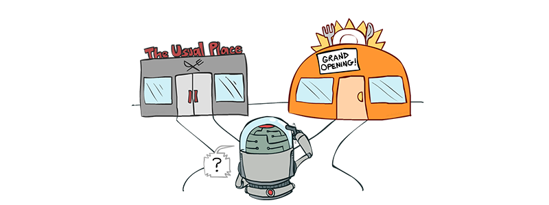

Reinforcement Learning is a computational approach to interaction-based learning. When you are learning how to walk, you are not told by anyone how much force to apply to each of your muscles. Instead, you repeatedly try to walk, and learn how to walk by favoring actions that helped you take a step and avoiding actions that led you to fall.

### Supervised vs Unsupervised vs Reinforcement Learning

Reinforcement Learning is different from other fields of Machine Learning such as Supervised Learning or Unsupervised Learning. The goal of Supervised Learning is to extrapolate from known data. However, in Reinforcement Learning problems, there are uncharted territories that require interactions with the environment to collect experience. Through **trial and error**, the learner/agent eventually learns favorable actions.

The goal of Unsupervised Learning is to find hidden structure in unlabeled data. In contrast, in Reinforcement Learning, although the agent does not receive information about the optimal action at each step, the agent is given a reward based on its actions, and its goal is to maximize the reward, not to find hidden structure.

Maximizing rewards is a challenging task because previous actions often affect your current state, action, and reward. If you stepped on a slippery ice on your last step and lost your balance, you will fall down in the next few steps. However, the negative reward from falling down is not shown to the agent after those few steps. In other words, actions can have **delayed reward**: the effect of an action might not be apparent from its immediate reward.

Because the effect of an action cannot be fully predicted, it is also crucial that the agent observes the environment frequently to react appropriately. For example, if you are walking on ice and you hear a crack, you should react to the observation and distance yourself from the crack rather than continuing to walk the same direction.

### Exploration vs Exploitation 

Another interesting aspect of Reinforcement Learning is the idea of balancing **exploration and exploitation**. The agent seeks to maximize its total reward, so it should *exploit* its knowledge and choose the action that will give the agent the most reward. However, to gain this knowledge, it needs to *explore* and test actions to estimate their rewards.

For example, suppose you move into a new neighbor and need to find a place to eat. At first, you do not know where the best restaurant is, so you try different restaurants (exploration). Once you tried a few places, you gain a preference and go to the same restaurant most times (exploitation). However, there might be some restaurants that you have not tried yet, so sometimes you try a new restaurant. Also, you might have chosen the wrong dish in some restaurants, so you might go to a restaurant you did not like and try a different dish. Until you go to every restaurant and try every dish multiple times, you cannot be sure you are making the best decision. However, the more experience you collect, the more certain you get.

### Elements of Reinforcement Learning

There are four central components in Reinforcement Learning: policy, reward signal, value function, and (optionally) the model of the environment.

The **policy** defines the agent's *behavior*. Simply, the policy maps an observed state to an action. Policies can be both deterministic or stochastic. In other words, the agent could always choose the same action for a same observation, or it could choose from multiple actions with some probabilities for the same observation.

The **reward signal** defines the *goal* in the Reinforcement Learning problem. Every time step, the environment gives the agent a number called the **reward**, and the agent's goal is to maximize the total reward it receives in the long run. Reward signal is the primary reason to alter a policy: low reward signifies bad situations, and high reward signifies favorable situations. Rewards are normally stochastic functions of the state of the environment and the actions taken by the agent.

The **value function** defines the *long-term result* of a state or an action. The **state value** (value of a state) is the expected total reward that the agent will accumulate in the long run starting from that state. Because the goal of the agent is to maximize reward in the long run, agents choose actions based on the value function, not the reward. Thus, the goal of almost all reinforcement learning algorithms is to estimate the value function efficiently.

Finally, the **model** of the environment is the model that allows the agent to infer the environment's behaviors. Models are used for planning: to predict the future without directly experiencing it. The model of the environment is not necessary to an agent. If the agent does not learn from a model, it learns only through trial and error. Reinforcement Learning methods that use models are called *model-based* methods, and those that do not are called *model-free* methods.

### Evolutionary Methods

Most Reinforcement Learning methods seek to estimate the value function. However, it is possible to solve Reinforcement Learning problems without estimating the value function. *Evolutionary methods* such as genetic algorithms or simulated annealing improve policies directly by creating a new generation of policies from a previous generation of policies. Like evolution in biology, policies with the most reward and their random variations are carried over to the next generation. 

These methods are effective if the policy space is small enough or if a good policy is common or easy to find. Also, it performs well even when the agent cannot fully observe the environment. However, in general, evolutionary methods ignore a lot of useful structure of a reinforcement learning problem. Evolutionary methods do not understand that a policy is a function from states to actions, or which states and actions the agent experiences and selects. Because evolutionary methods do not utilize this information for more efficient search, it is not particularly well suited for Reinforcement Learning problems.

---

*This is a summary of Sections 1.1, 1.2, 1.3, 1.4 of Reinforcement Learning: An Introduction by Richard S. Sutton and Andrew G. Barto. You can find the full book [in their website](http://incompleteideas.net/book/the-book-2nd.html).*

*Pictures from [NIPS AI for Prosthetics Competition](https://github.com/stanfordnmbl/osim-rl), [energy_py](http://adgefficiency.com/energy_py-reinforcement-learning-for-energy-systems/), and [Probyto](https://probyto.com/articles/Exploration%20vs%20Exploitation%20trade-off%20for%20evolving%20Data%20Science).*