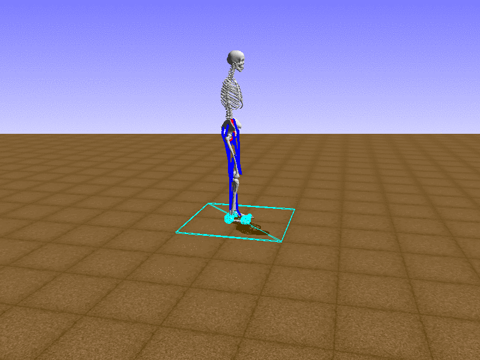
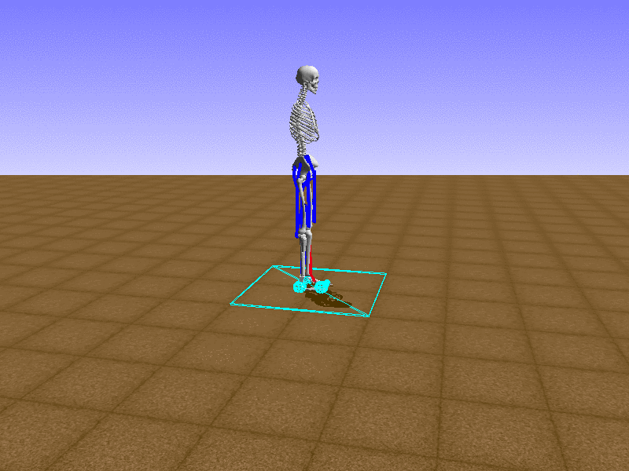

# AI for Prosthetics Week 2: Understanding the Action Space

* [Week 1: Understanding the Challenge](/blog/ai-for-prosthetics-1)
* **Week 2: Understanding the Action Space**

## Muscles

[Last week](/blog/ai-for-prosthetics-1), we briefly saw how a valid action consisted of 19 numbers, each  between 0 and 1. The 19 numbers represented the amount of force to put to each muscle. I do not have any knowledge on muscles, so I decided to manually go through all the muscles to understand the effects of each muscle.

#### Index 0

#### Index 1

#### Index 2

#### Index 3

#### Index 4

#### Index 5

#### Index 6

#### Index 7

#### Index 8

#### Index 9

#### Index 10

#### Index 11

#### Index 12

#### Index 13

#### Index 14

#### Index 15

#### Index 16

#### Index 17

#### Index 18

Let's test our intuition by trying to create a "hip-thrust" action. It looks like indices 2, 3, 10, 11 are the muscles at the back of the upper leg, so let's try fully activating these muscles.

Awesome! We now have some intuition on what muscles the agent might want to use.

## KerasDDPGAgent

Looking at the effects of each index of the action was exciting, but unless we are trying to fully handcraft an agent, we also need to implement a learning algorithm. Fortunately, 

## What's Next?

